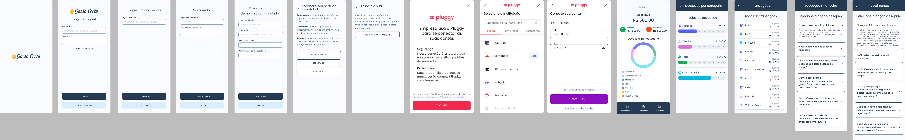

# HackWeek Project

This project is part of the HackWeek event developed for the [+Devs2Blu](https://www.devs2blu.com.br/) 
program.

## Table of Contents

- [Installation](#installation)
- [Configuration](#configuration)
- [Authenticating to GitHub Packages](#authenticating-to-github-packages)
- [Health Check](#health-check)
- [Project Requirements](#project-requirements)
- [Project Figma](#project-figma)

## Installation

1. Clone the repository:

```bash
git clone https://github.com/EduardoOrthmann/hackweek-devs2blu-backend.git
```

2. Install dependencies with Maven.

> Note: The project uses pluggy-java as a dependency. This dependency is only available in the GitHub Packages repository
> to which you must be authenticated. To authenticate, follow the instructions as mentioned here [Authenticating to GitHub Packages](#authenticating-to-github-packages).

3. Configure the database connection in the application.properties file as mentioned here [Configuration](#configuration).

4. Run the application.

## Configuration

The following properties can be configured in the application.properties file:

```markdown
# DATABASE
spring.datasource.url=jdbc:postgresql://localhost:5432/your_database
spring.datasource.username=your_username
spring.datasource.password=your_password
spring.datasource.driver-class-name=org.postgresql.Driver

- Replace USERNAME with your GitHub username.
- Replace TOKEN with the personal access token you created.

# HEALTH CHECK
management.endpoint.health.show-details=always
```

# Authenticating to GitHub Packages

- Create a personal access token in your GitHub account. [Creating a personal access token](https://docs.github.com/en/github/authenticating-to-github/creating-a-personal-access-token)
- Create a file named settings.xml in the .m2 folder in your user directory. [Settings](https://maven.apache.org/settings.html)
- Add the following configuration to the settings.xml file:

```markdown
<?xml version="1.0" encoding="UTF-8"?>
<settings xmlns="http://maven.apache.org/SETTINGS/1.0.0"
xmlns:xsi="http://www.w3.org/2001/XMLSchema-instance"
xsi:schemaLocation="http://maven.apache.org/SETTINGS/1.0.0 http://maven.apache.org/xsd/settings-1.0.0.xsd">
<activeProfiles>
<activeProfile>github</activeProfile>
</activeProfiles>

  <profiles>
    <profile>
      <id>github</id>
      <repositories>
        <repository>
          <id>central</id>
          <url>https://repo1.maven.org/maven2</url>
        </repository>
        <repository>
          <id>github</id>
          <url>https://maven.pkg.github.com/pluggyai/*</url>
          <snapshots>
            <enabled>true</enabled>
          </snapshots>
        </repository>
      </repositories>
    </profile>
  </profiles>

  <servers>
    <server>
      <id>github</id>
      <username>USERNAME</username>
      <password>TOKEN</password>
    </server>
  </servers>
</settings>
```

## Health Check

The health check endpoint is available at http://localhost:8080/actuator/health

Below are the possible responses:

```
{
    "status": "UP",
    "components": {
        "db": {
            "status": "UP",
            "details": {
                "database": "PostgreSQL",
                "validationQuery": "isValid()"
            }
        },
        "diskSpace": {
            "status": "UP",
            "details": {
                "total": 499963174912,
                "free": 249963174912,
                "threshold": 10485760
            }
        },
        "ping": {
            "status": "UP"
        }
    }
}
```

```
{
    "status": "DOWN",
    "components": {
        "db": {
            "status": "DOWN",
            "details": {
                "database": "PostgreSQL",
                "validationQuery": "isValid()"
            }
        },
        "diskSpace": {
            "status": "UP",
            "details": {
                "total": 499963174912,
                "free": 249963174912,
                "threshold": 10485760
            }
        },
        "ping": {
            "status": "UP"
        }
    }
}
```

## Project Requirements

### Functional Requirements

1. **User Registration**:
Allow users to register in the application by providing personal information such as name, email, and password.

2. Investment Profile Registration:
Allow the user to register their investment profile, choosing between Conservative, Moderate, and Aggressive.

3. Bank Account Association:
Allow the user to link their bank account through Pluggy.

4. User Login:
Allow users to securely log in to the application.

5. Password Recovery:
Allow users to recover their password using a code sent via email.

6. View Income and Expenses and Current Balance:
Present a summary of the user's bank account, including the current balance, income, and expenses, with income and expenses grouped by month.
The summary will be automatically generated based on the previous month.

7. Manual Update of Income and Expenses:
When clicked on income or expenses, the user can manually edit them.

8. Expense Categorization:
Allow users to dynamically categorize their transactions (e.g., food, housing, transportation, entertainment).

9. View User's Expenses Chart by Category:
Allow the user to view their expenses by category on a pie chart and a percentage bar chart, organized by month.

10. View Transactions:
Allow the user to see their transactions for the month.

11. ChatGPT for Financial Feedback:
Integrate a chatbot (ChatGPT) that provides financial feedback based on transactions, spending categories, and the user's financial profile.
The chatbot should offer ready-made scripts to improve the user's financial situation.

12. View ChatBot Question Options:
The system should provide questions from the ChatBot for the user to click on.

13. Financial Investment:
Collect data on the user's spending and their investor profile.
Provide investment recommendations based on the collected data, taking into account risk and investment horizon.

### Non-Functional Requirements

1. **Security**: Implement robust security measures to protect user data, including data encryption and secure authentication.

2. **Usability**: Design an intuitive and easy-to-navigate user interface.

3. Accessibility

4. **Integrations: Integrate with banking systems to automatically import transactions and ensure that the chatbot can access relevant data for accurate feedback.

5. **Privacy: Comply with data privacy regulations and obtain user consent to collect and use their financial data.

6. **Documentation: Provide detailed documentation.


### Business Rules

1. For the login screen: A user can be associated with only one email.

2. For the login screen: Each password must contain a minimum of 8 alphanumeric characters, including numbers and letters.

3. For the registration screen: The "Full Name" field cannot contain numeric characters.

4. For the registration screen: In the "Choose Your Password" field, each password must contain a minimum of 8 alphanumeric characters, including numbers and letters.

5. For the registration screen: The "Confirm Your Password" field must match the password entered in the "Choose Your Password" field.

6. For the registration screen: The "Continue" button will only work if all registration fields are filled out correctly.

7. For the Investor Profile screen: In the "Choose Your Investor Profile" field, the user must choose only one of the three options offered by the application: Conservative, Moderate, Aggressive.

8. For the Investor Profile screen: The user can update or change their previous choices.

9. For the "Link Your Bank Account" screen: The user must link their bank accounts.

10. Pluggy: The user needs to choose a financial institution to proceed with registration.

11. Main Screen: The user can choose which month of the year they want to view the information.

12. Expenses by Category: Each transaction item will be associated with only one category: Grocery, Gasoline, Leisure, and Others.

13. Financial Education: The user can list all financial education items.

14. Financial Education: When selecting a financial education item, the system should provide a description of that item.

15. Investments: The user can list all investment items.

16. Investments: When selecting an investment item, the system should provide a description of that item.

17. Cardbox: The Cardbox will inform the user how much they can invest or how much they can commit their income to a particular investment.

# Project Figma

